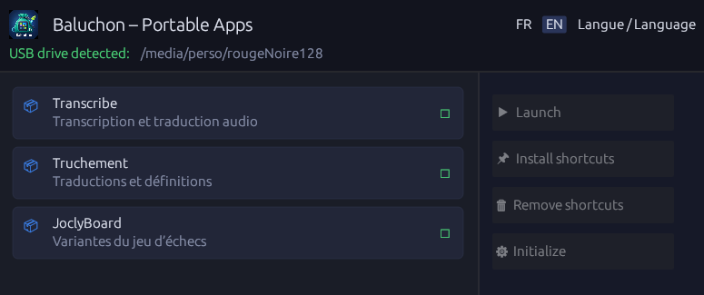

# 💾 Baluchon – Gestionnaire d'applications portables

Interface graphique multiplateforme (Linux / Windows) pour gérer les applications portables d'une clé USB.
---
## ⚠️ Repository moved

The development of this project has been moved to:

👉 [https://codeberg.org/fhoudebert/download-assistant](https://codeberg.org/fhoudebert/baluchon)

This repository is kept only for:
- the release history

Please refer to the new repository for contributions and the latest source code.

## ⚠️ Dépôt déplacé

Le développement de ce projet a été déplacé vers :

👉 [https://codeberg.org/fhoudebert/download-assistant](https://codeberg.org/fhoudebert/baluchon)

Ce dépôt est conservé uniquement pour :
- l’historique des versions publiées

Merci de vous référer au nouveau dépôt pour les contributions et le code source à jour.
---

## Features

| Feature                                               | Linux                            | Windows                 |
| ----------------------------------------------------- | -------------------------------- | ----------------------- |
| Automatic USB drive detection                         | ✅ `/media`, `/run/media`, `/mnt` | ✅ Drive letters D: → Z: |
| `apps.json` parsing                                   | ✅                                | ✅                       |
| Launch an application                                 | ✅                                | ✅                       |
| Install a shortcut                                    | ✅ `.desktop`                     | ✅ `.lnk` (PowerShell)   |
| Remove a shortcut                                     | ✅                                | ✅                       |
| Open download URL                                     | ✅ `xdg-open`                     | ✅ `start`               |
| Desktop environment detection (GNOME, KDE, Cinnamon…) | ✅                                | —                       |
| Desktop shortcut creation                             | ✅                                | —                       |
| `.desktop` database update                            | ✅ `update-desktop-database`      | —                       |
| FR/EN internationalization                            | ✅                                | ✅                       |

## Screenshots

### GUI

## Licence

MIT
